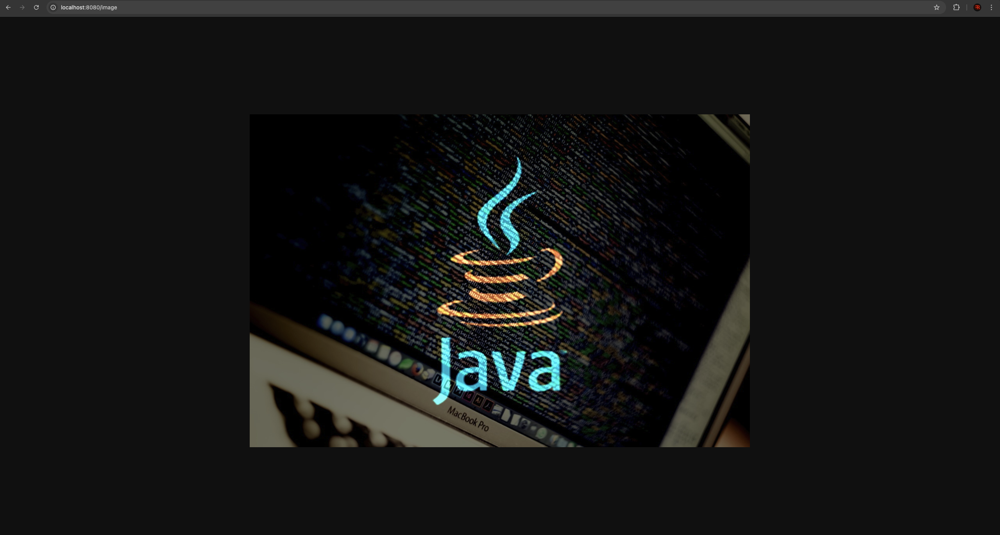

# Java
## Файл CustomServer
Реализация сервера, которая открывается по ссылке: http://localhost:8080.  
После запуска сервера можно воспользоваться:
- http://localhost:8080/login - GET запрос, который случайным образом генерирует UUID токен, и хранится в HashSet, так как в этой реализации самый быстрый доступ к значениям.  
- http://localhost:8080/image - GET запрос, который отображает фото image.jpg которая так же хранится в директории сервера.  
- http://localhost:8080/game - POST запрос, который принимает токен и один из вариантов из игры "Камень, ножницы, бумага"
- http://localhost:8080/login - DELETE запрос, который принимает токен и абсолютный путь к файлу, которую требуется удалить.

Пример работы:  
1. Запрос: `curl http://localhost:8080/login`
Ответ сервера: `{"token": "32a3d9e6-735b-4d60-8f7d-b5ffbc94bfe3", "message": "Login successful", "active_tokens": 1}`

2. Запрос на отображение изображения:

3. Запрос: `curl -X POST http://localhost:8080/game -d "token:33bbaab2-a9a6-4ed0-88eb-ffa8e5cfafd1,choice:Ножницы"`  
Ответ сервера: `{"error":"Incorrect input token"}`

3. Запрос: `curl -X POST http://localhost:8080/game -d "token:32a3d9e6-735b-4d60-8f7d-b5ffbc94bfe3,choice:Ножницы"`.  
Ответ сервера: `{"status":"Win"}`

4. Запрос: `curl -X DELETE "http://localhost:8080/delete" -d "path:/Users/ruslanahmetsafin/****,token:3736319f-2af6-43b9-819b-be360e39a32d"`.  
Ответ сервера: `{"error":"Incorrect input token"}`. 

4. Запрос `curl -X DELETE "http://localhost:8080/delete" -d "path:/Users/ruslanahmetsafin/****,token:32a3d9e6-735b-4d60-8f7d-b5ffbc94bfe3"`.  
Ответ сервера: `Deleted file`

## Файл GenerateToken. 
Пытался через подобрать токен, разделил на многопоточность, сделал 6 потоков, не запаривался о возможности повтора токенов, т.к. их там очень много, единственное что отследил, то что UUID 4-го поколения, самый защищенный вид токена, спустя 6 часов перебора, результат 0, в секунду перебиралось около 12 различных токенов, всего за это время было перебрано около 259 000 токенов, не одна не попала, я остановился :(  

## Работу с API не вижу смысла показывать, там ничего интересного, просто 1-2 метода, не знаю за что там баллы ставите :(