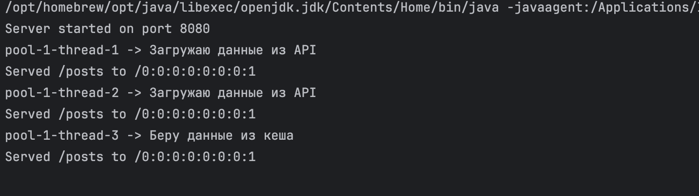

# Java
Реализация всего сервера представлена как 4 класса и основной класс Main.  
## Класс Post  
Данный класс хранит данные одного возвращаемого элемента:
1. Хранит все необходимые данные: userId, id, title, body.  
2. Реализованы геттеры для каждой переменной.  
3. Реализован метод возвращающий все в JSON формате.  
## Класс ApiClient  
1. Стандартная инициализация
2. Делает запрос в открытый api для общей работы: `https://jsonplaceholder.typicode.com/posts`.  
3. Метод readFully возвращает всю информацию из входного потока. 
4. Метод parsePosts возвращает массив состоящий из класса Post.  
5. Метод extractInt возвращает число из строки. 
6. Метод extractString возвращает строку убрав из него лишние переводы строки. 
7. Метод extractRawValue подстроку до ближайшего знака разделения. 
## Класс DataService
Обеспечивание синхронное обновление и возвращение списка состоящая из класса Post.  
1. Стандартная инициализация.  
2. Метод getPosts возобновляет данные каждое определенное значение в секундах.  
3. Метод isCacheExpired отслеживает сколько времени прошло
## Класс HttpServer 
Непосредственно наш сервер, который будет отобрражать наши данные.  
1. Стандартная инициализация
2. Метод start запускает сервер по нашему порту в локальном сервере. 
3. Метод handleClient читает запрос клиента и возвращает массив состоящий из класса Post.  
4. buildJsonResponse формирует JSON строку.  
## Класс Main.  
Запускает все виды задач и запускает сервер.  
  
Pool - это пул потоков.  
thread  - это непосредственный поток, который обращается к классу DataService.  
Далее идёт вид работы.  
Между первым и вторым запросом прошла 1 минута, соответсвенно файл обновился через изначальный API и обновил массив состоящий из класса Post.  
Третий запрос был сразу после второго.  

Отображение JSON в браузере